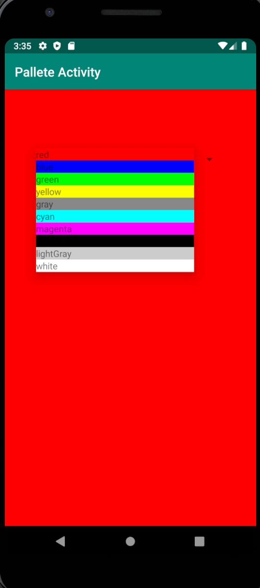
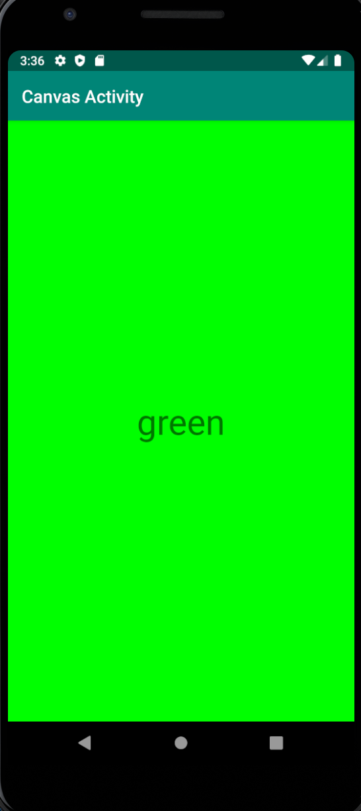

# CIS3315_Lab4_ColorActivityPasser

This app allows the user to select a color from a spinner which will then open a second activity that displays 
the selected color name and makes the second activity's background match the color.'

*This app was practice opening a second activity and passing it information*

